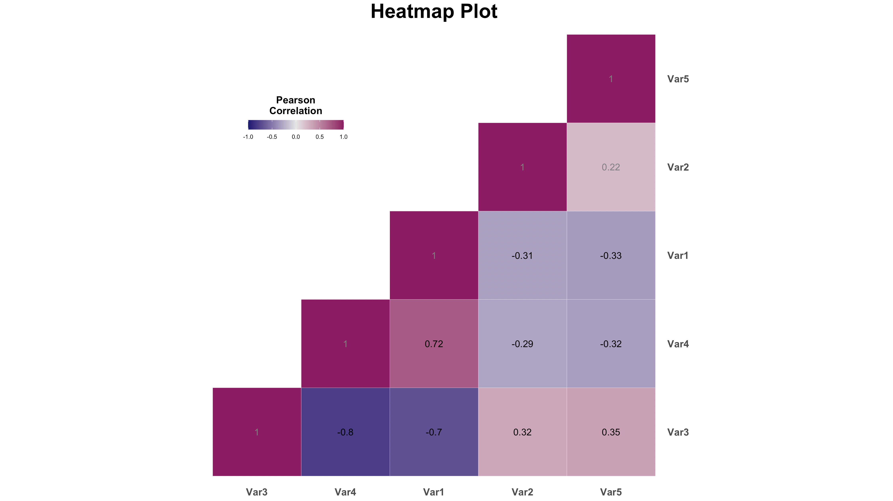

# Heatmaps
A guide to heatmaps &amp; correlations

The heatmap script utilizes 'pairwise complete' observations, meaning only individuals with missing data for the 2 variables being compared will be removed. This script includes the option of saving correlation coefficients, p-values, and the number of observations included for each pairwise correlation. These files will save in the working directory set at the top of the script, and are named 'heatmap_coefficients.csv', 'heatmap_pvalues.csv', 'heatmap_nvalues.csv', respectively.

To calculate correlations amongst variables, data are required to be in the wide format - subsequently being changed into long format for data visualization (which is done efficiently without user input in the script). The heatmap script does not use the mock data in its example (as mock data tend not to be correlated to one another). However, the example is of a data set in wide format, with the variable names "Variable_1" through to "Variable_5". These are placed in a different order (as seen in the plot above) so that they read from left to right and bottom to top of the heatmap. They are subsequently renamed (abbreviated) for the final heatmap.

### Packages:

This script also uses the [Hmisc](https://github.com/harrelfe/Hmisc) and [reshape2](https://github.com/hadley/reshape) packages.
